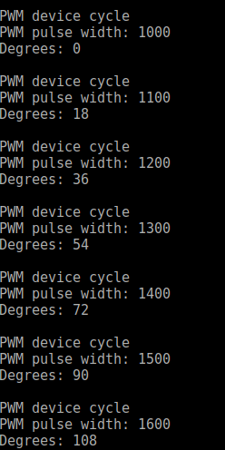

<br/>
Handling PWM next to GPIO control is one of the most popular step in edge device control. Usually pulse width modulation signal is used to steer servo angular position. In this post I would like to show how to enable PWM in Zephyr on [ST Nucleo L476RG](https://docs.zephyrproject.org/latest/boards/arm/nucleo_l476rg/doc/index.html) board with simple sevo example.

# Post Overview
1. PWM signal
2. PWM in Zephyr
3. Source code
4. Building, Flashing and Results

## PWM signal
Pulse Width Modulation known as PWM is a method of signal adjustment consisting in changing the signal filling. Typical servo expects a pulse of every period (usually 20 ms). To control servo angular position one should change a pulse width. Usually servo 0&deg; position is connected with pulse width equal to 1 ms: 

<p align="center">
  
</p>

In turn 180&deg; is described by pulse width equal to 2 ms:

<p align="center">
  
</p>

Pulses between 1 and 2 ms width describe angular positions between 0&deg; and 180&deg;. For example 90&deg; is associated with 1.5 ms pulse width.

## PWM in Zephyr
Project directory of PWM application should has a form:
<p align="center">
  
</p>

It contain 4 significant files:
- `CMakeLists.txt` - project's source files and targets
- `prj.conf` - Kconfig file with configuration options
- `<board>.overlay` file which override node property values (optional)
- source code file (`main.c`)

Firstly, we have to prepare `CMakeLists.txt` file which sets minimum CMake version and pulls in Zephyr build system which creates a CMake target name app. With `target_sources` function we can include the sources to build.
```make
# Boilerplate code, which pulls in the Zephyr build system.
cmake_minimum_required(VERSION 3.13.1)
include($ENV{ZEPHYR_BASE}/cmake/app/boilerplate.cmake NO_POLICY_SCOPE)
project(first)

# Add your source file to the "app" target. This must come after
# the boilerplate code, which defines the target.
target_sources(app PRIVATE src/main.c)
```
We have also set application configuration options (Kconfig Configuration) in `prj.conf` file.
```vim
CONFIG_STDOUT_CONSOLE=y
CONFIG_PRINTK=y
CONFIG_PWM=y
```
Using `nucleo_l476rg.overlay` file in application folder we can override node property values and enable PWM pin which is part of timer2 node.
```vim
&timers2 
{   
    status = "okay"; 
    pwm {
        status = "okay";
        label = "PWM_2";
    };
};
```
Originally both timer2 and his pwm are disabled.
<p align="center">
  
</p>
This is very important to change their status to `okay` if you want to use them. Devicetree is in `dts` directory in Zephyr folder and specific boards devicetree files should be find in `dts/<ARCH>/<vendor>/<soc>.dtsi`.

## Source code
Application source code is in `main.c` file in `src/` directory.

Firstly, we should include some libraries to enable for example using PWM or printing via serial port:
```c
#include <zephyr.h>
#include <device.h>
#include <drivers/gpio.h>
#include <sys/printk.h>
#include <drivers/pwm.h>
#include <kernel.h>
```
In the second step we define alias for PWM pin which is equal to `PWM_2` according to [ST Nucleo L476RG](https://docs.zephyrproject.org/latest/boards/arm/nucleo_l476rg/doc/index.html) Zephyr documentation (`PWM_2_CH1 : PA0`):
```c
#define DT_ALIAS_PWM_0_LABEL "PWM_2"
```
Next we declare some macros which help us in PWM control:
```c
/* period of servo motor signal ->  20ms (50Hz) */
#define PERIOD (USEC_PER_SEC / 50U)

/* all in micro second */
#define STEP 100    /* PWM pulse step */
#define MINPULSEWIDTH 1000  /* Servo 0 degrees */
#define MIDDLEPULSEWIDTH 1500   /* Servo 90 degrees */
#define MAXPULSEWIDTH 2000  /* Servo 180 degrees */

#define SLEEP_TIME_S 1  /* Pause time in seconds*/
```
To control PWM pulse width is used the following function:
```c
void PWM_control(u8_t *dir, u32_t *pulse_width)
{
	if (*dir == 1U)
	{
		if (*pulse_width < MAXPULSEWIDTH)
		{
			*pulse_width += STEP;
		}
		else
		{
			*dir = 0U;
		}
	}
	else if (*dir == 0U)
	{
		if (*pulse_width > MINPULSEWIDTH)
		{
			*pulse_width -= STEP;
		}
		else
		{
			*dir = 1U;
		}
	}
}
```
It control the direction of angular position change with variable `dir` and properly increase or decrease `pulse_width` value.

Another step is to change pulse width from time to more readable format - degrees. We can do it in simple way:
```c
void get_deegrees(u8_t *degrees, u32_t *pulse_width)
{
	*degrees =  (u8_t)((float)(*pulse_width - MINPULSEWIDTH) / (float)(MAXPULSEWIDTH - MINPULSEWIDTH) * 180.0);
}
```
The main function is bigger than previous code blocks so I explain its parts below.
```c
void main(void)
{
	printk("Servo control program\n");
	/* Set PWM starting positions as 0 degrees */
	u32_t pulse_width = MINPULSEWIDTH;
	u8_t dir = 0U;
	u8_t degrees = 0U;

        struct device *pwm_dev;

	pwm_dev = device_get_binding(DT_ALIAS_PWM_0_LABEL);
	if (!pwm_dev)
	{
		printk("Cannot find PWM device!\n");
		return;
	}
	else
	{
		printk("PWM device find\n");
		printk("%s\n", DT_ALIAS_PWM_0_LABEL);
	}

	while (1)
	{
		printk("PWM device cycle\n");
		if (pwm_pin_set_usec(pwm_dev, 1, PERIOD, pulse_width, 0))
		{
			printk("PWM pin set fails\n");
			return;
		}
		get_deegrees(&degrees, &pulse_width);

		printk("PWM pulse width: %d\n", pulse_width);
		printk("Degrees: %d\n", degrees);
                
                PWM_control(&dir, &pulse_width);

                printk("\n");

		k_sleep(K_SECONDS(SLEEP_TIME_S));
	}
}
```
At the beginning of main function we should define device structrue and create device object by `device_get_binding` function ([documentation](https://docs.zephyrproject.org/apidoc/latest/group__device__model_ga48c624e18076c7658362c6b763c2bf5e.html))
```c
struct device *pwm_dev;

pwm_dev = device_get_binding(DT_ALIAS_PWM_0_LABEL);
if (!pwm_dev)
{
	printk("Cannot find PWM device!\n");
	return;
}
else
{
	printk("PWM device find\n");
	printk("%s\n", DT_ALIAS_PWM_0_LABEL);
}
```

In while loop we can find 4 functions:
```c
pwm_pin_set_usec(pwm_dev, 1, PERIOD, pulse_width, 0)
```
This function set the period and pulse width for a single PWM output ([documentation](https://docs.zephyrproject.org/apidoc/latest/group__pwm__interface_gaa8771a14de482abbc3acf1458d23e752.html)).
```c
get_deegrees(&degrees, &pulse_width);
```
It is our function presented above which change pulse width value to degrees.

```c
PWM_control(&dir, &pulse_width);
```
This function change pulse width and it is also shown above.
```c
k_sleep(K_SECONDS(SLEEP_TIME_S));
```
`k_sleep` function puts the current thread to sleep for given duration ([documentation](https://docs.zephyrproject.org/1.9.0/api/kernel_api.html#_CPPv37k_sleep5s32_t)).

## Building, Flashing and Results

Having written implementation of PWM use in Zephyr and enabled it in devicetree overlay we can go to project directory and build it with the command:
```bash
west build -p auto -b nucleo_l476rg .
```
After correct building we should connect servo with board pins:
- GND (brown)	<--> board GND
- 5V (red)	<--> board 5V
- Signal (orange)	<--> A0 pin

Next we can flash application to device:
```bash
west flash
```
As a results servo moves between 0&deg; and 180&deg; with 18&deg; step. 


We can also check program results using the serial port communication with `picocom` application with baud rate equal to `115200` and ST device connected with USB to port `/ttyACM0`:
```bash
picocom -b 115200 /dev/ttyACM0
```

To check device `/tty` you can use `dmesg` command in shell. Result of this command in my example:
<p align="center">
  
</p>


Serial port messages:
<p align="center">
  
</p>

## Summary
To sum up, I think that PWM is very useful in particular if you use servo. Zephyr on board ST Nucleo L476RG ensures this fincjonality. When I started my adventure with Zephyr I didn't find simple explanation how to use PWM in Zephyr system on my board so I think that this post will be helpful if you want to start with Zephyr's PWM.