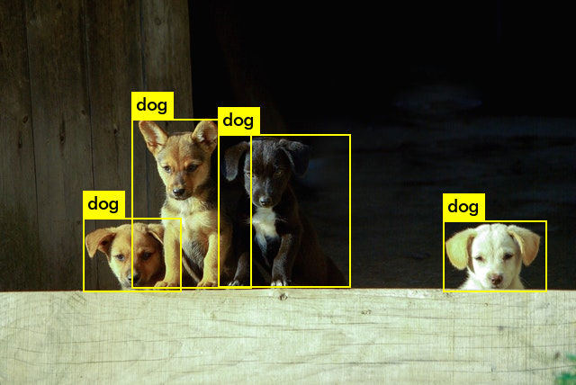

Many state-of-the-art algorithms for object detection are trained evaluated on a COCO dataset set. In this article I show you how to adapt your collection to this format.

### Directory structure

Of course, you can arrange the folders differently. However, this is the easiest way to be compatible with the COCO dataset. It is correct to keep the training, validation and test sets in separate `.json` files. The type of photos does not matter, and if you want to divide them into folders, you must include the names of the folders when creating dictionaries of the data set.

``` bash
.
├── annotations
│   ├── test.json
│   ├── train.json
│   └── val.json
└── images
    ├── 00000.png
    ├── 00001.jpg
    ├── 00002.png
    ├── 00003.jpeg
    ... 

```

### Main dictionary
In Python, you can build such a dataset using dictionaries and lists, and finally serialize it using the `json` module. The structure of the main dictionary is shown in the following code:

``` python
dataset_dict = {
  'type': 'instances', 
  'info': info_dict, 
  'categories': categories_list, 
  'images': images_list, 
  'annotations': annotations_list, 
}
```

### Info dictionary
The following dictionary contains information about your dataset. Filling these is not required, but a dictionary with such keys should be created. It is worth thinking about supplementing this dictionary if you want to make your data public.

``` python
info = {
  "description": "description of your data set", 
  "url": "home page of the project or data set", 
  "version": "dataset version, eg. 1.0", 
  "year": 2020, 
  "contributor": "your name or organization", 
  "date_created": "date in 2020/04/19 format"
}
```

### Categories list
The supercategory is not considered and is only used to group smaller categories (it can be shared by everyone). For example, for the supercategory `shapes` , we can define a category, such as `square` , `circle` or a `star` . Category ID must be unique.

``` python
categories_list = [
  {
  "supercategory": "name of the main categories, e.g.shape", 
  "id": cetegory_id, 
  "name": "category name, e.g.square"
  }
]

```

### Images list
Then `file_name` should be the relative path from the main image folder. The most important is the size of the image (`width` and `height`) and its individual `id`, which the annotations will refer to.
``` python
images_list = [
  {
  "license": 0, 
  "file_name": "file name, e.g.00000.png", 
  "coco_url": "", 
  "height": image.shape[0], 
  "width": image.shape[1], 
  "date_captured": "", 
  "flickr_url": "", 
  "id": image_id
  }
]
```

### Annotations list

As for the annotation dictionary, each box has a separate instance, even if it relates to the same photo. `bbox` is a list with the upper left corner of the photo and its size.
``` python
annotations_list = [
  {
  "segmentation": [], 
  "area": 0, 
  "iscrowd": 0, 
  "image_id": image_id, 
  "bbox": [x_pose, y_pose, image_width, image_height], 
  "category_id": category_id, 
  }
]
```

#### Now you can test the latest models on your collection of puppy images. Good luck!



