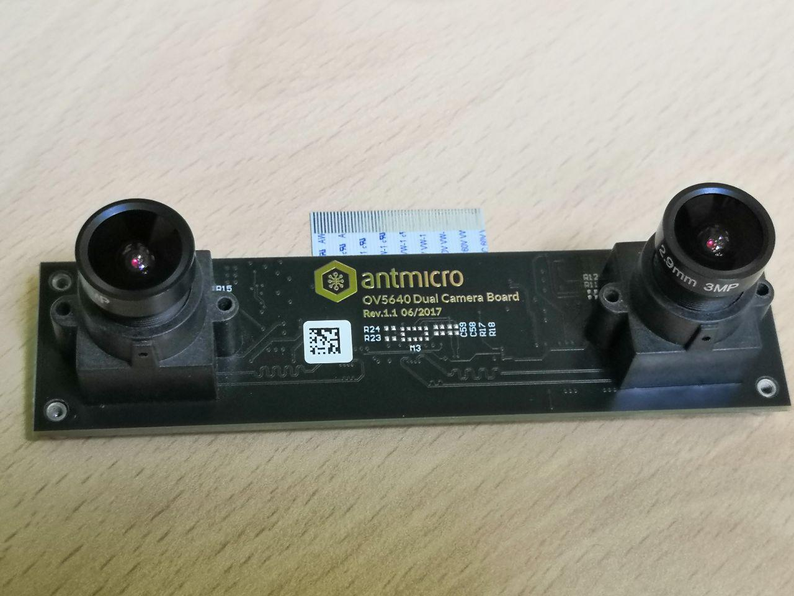

This post is an introduction to the task of [OpenCV camera calibration](https://docs.opencv.org/master/dc/dbb/tutorial_py_calibration.html) and creating a deep image from a stereo vision camera. The first topic is to get the right calibration data.

# Dual camera device

In my experiments I use the Antmicro OV5640 Dual Camera Board camera ([brother of this camera](https://antmicro.com/blog/2020/04/ov9281-camera-module/)), which is connected via the [MIPI Serial Camera Interface 2](https://www.mipi.org/specifications/csi-2). The distance between the cameras is about 7 cm. With such a base, we should be able to achieve depth for the image in the range of about 0.5m to 3m.

# Checkerboard target
I use the standard checkerboard pattern from [kalibr toolbox](https://github.com/ethz-asl/kalibr/wiki). The source of the calibration target from the 7x6 (inside corners count) checkerboard is in the [pdf file](https://drive.google.com/file/d/0B0T1sizOvRsUVmJZYW9XWFZRdE0/edit?usp=sharing). When I printed it on A3 size paper, I obtained squares with a side of 0.0417 meters.

# Source code
This task is not difficult - just collect the image for the left and right cameras simultaneously. For ease of use, they have the same name but go to different folders. **If that's enough for you, I invite you to the [source code](https://github.com/bartoszptak/Depther/blob/c0a99915f3d7f6820a3cc195f5ae09f9a471b7f2/1_collect_images.py#L13).** Note which camera ID is on the left - this will be important at later stages.

An interesting thing is to use `.grab()` and `.retrieve()` instead of `.read()`. According to the [documentation](https://docs.opencv.org/4.3.0/d8/dfe/classcv_1_1VideoCapture.html), `.grab()` is used when we have multiple cameras and hardware synchronization is not guaranteed. The operation `.retrieve()` is time consuming, so first get frames for both cameras, then decode it. Therefore, using the `.read()` method, which performs both operations one after the other, increasing the chance of reading off-time.

#### The next step will be to detect the corners of the checkerboard and calibrate the cameras. Soon!