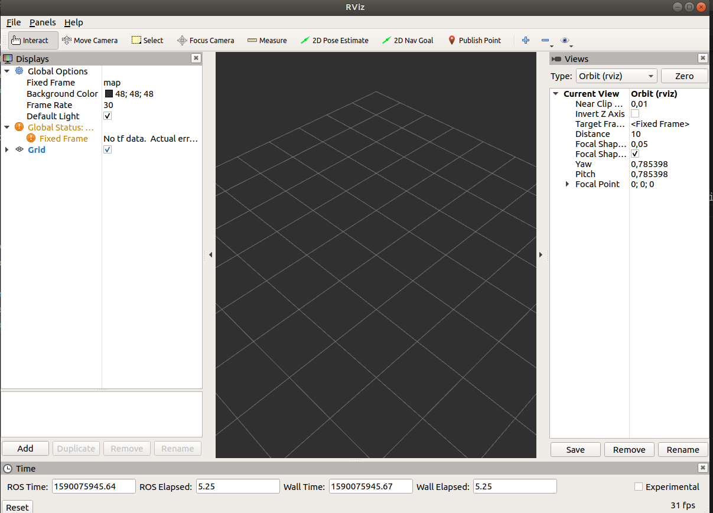
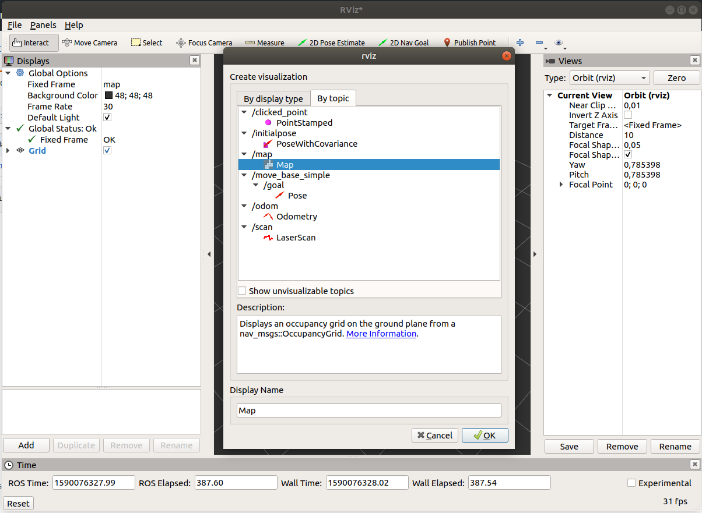
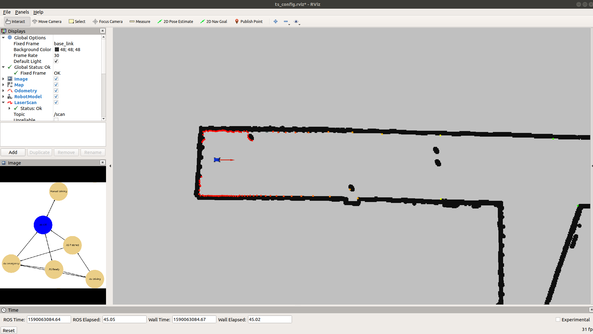

Rviz allow to subscribe and show ROS topics. It is the simplest form of visualization messages like `OccupancyGrid` or `LaserScan`.  Every time when you use ROS and have running roscore, you can run Rviz with command `rosrun rviz rviz`. 

<p align="center">
  
</p>

In showed Rviz window you can add topics by `add` button in left down corner. 

<p align="center">
  
</p>

It is very simple, fast and convenient way to visualize and check messages published by topics. Moreover, when you create ROS project and want to use Rviz application as a visualization of project's processes, you can create Rviz's node in launch file.

```xml
<!-- Launch rviz -->
<node type="rviz" name="rviz" pkg="rviz"/>
```

Adding this node to launch file let to automatically run Rviz with command:

```bash
roslaunch <project_name> <launch_file_name>.launch
```

However, it only run empty Rviz window, without added subscribed topics. If you want run configured window in Rviz you have to save it settings to `<rviz_config_file>.rviz` using `File -> Save Config As`. Project structure with Rviz config file is shown below.

```bash
.
├── CMakeLists.txt
├── include
│   └── project_name
|       └── <file_1>.hpp
├── launch
│   └──  <launch_file_name>.launch
├── package.xml
├── rviz
│   └──  <rviz_config_file>.rviz
├── scripts
│   └──  <script_file>.py
└── src
    └── <file_1>.cpp
```

After saving application window configuration it is important to indicate this file as an argument for Rviz node in launch file.

```xml
<!-- Launch rviz -->
<node type="rviz" name="rviz" pkg="rviz" args="-d $(find <package_name>)/rviz/<rviz_config_file>.rviz" />
```

In result, you get the same project visualization as you save in Rviz config file.

<p align="center">
  
</p>

To sum up, Rviz config file lets to get the same application window every time you run roslaunch file. It is very convenient option to show configured ROS project application.