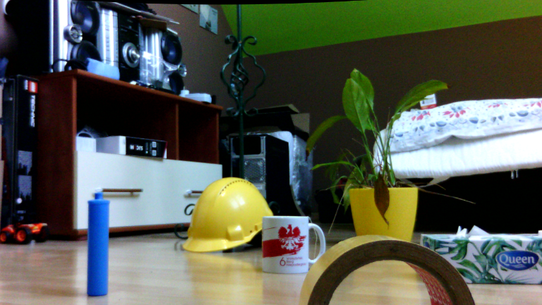
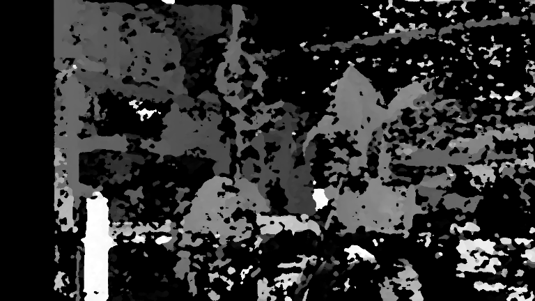

### Previous parts
*  **[Depther project - part 1: collect calibration data](../depther-collect-calibration-data)**
*  **[Depther project - part 2: calibrate dual camera, parameters rectification](../depther-calibrate-cameras)**

This article is a direct continuation of the previous part. To start working in this part, we need parameters such as:
* matrix - camera internal parameters
* distortion - distortion coefficients
* rectification - makes the camera optical axes parallel
* projection - target matrix

### Remapping

Using the above matrices, we will now create a [function](https://docs.opencv.org/3.4/da/d54/group__imgproc__transform.html#ga7dfb72c9cf9780a347fbe3d1c47e5d5a) that maps the image according to distortion. We perform the steps at this point separately for the left and right cameras.

``` python
map_left = cv2.initUndistortRectifyMap(
            matrix,
            distortion,
            rectification,
            projection,
            size, cv2.CV_32FC1)
```

And we will [use it](https://docs.opencv.org/3.4/da/d54/group__imgproc__transform.html#gab75ef31ce5cdfb5c44b6da5f3b908ea4) for the input image. Characteristic black areas may appear at the edges. The greater the distortion, the larger the black regions. Now the edges in the image should be straight.

``` python
remaped_left = cv2.remap(
                    img_left, 
                    map_left[0],
                    map_left[1], 
                    cv2.INTER_LINEAR)
```


### Stereo image and depth

For depth image, in OpenCV you can use [StereoBM](https://docs.opencv.org/3.4/d9/dba/classcv_1_1StereoBM.html) and [StereoSGBM](https://docs.opencv.org/3.4/d2/d85/classcv_1_1StereoSGBM.html) among others. The difference between them is described [here](https://stackoverflow.com/a/58741047). We have obtained better results for the second algorithm.

The selection of the parameters of the selected algorithm depends on the cameras used. They have been described in the [documentation](https://docs.opencv.org/3.4/d2/d85/classcv_1_1StereoSGBM.html#adb7a50ef5f200ad9559e9b0e976cfa59) - it is worth starting work from the default values.

``` python
stereo = cv2.StereoSGBM_create(
            minDisparity = 1,
            numDisparities = 128,
            blockSize = 3,
            P1 = 8*3**2,
            P2 = 32*3**2,
            disp12MaxDiff = 1,
            preFilterCap = 63,
            uniquenessRatio = 10,
            speckleWindowSize = 100,
            speckleRange = 32,
            mode = 0)
```

The `compute` method accepts black and white images for the left and right cameras. Then we normalize the resulting image to a range of 0 - 255.

``` python
depth = stereo.compute(grey_left, grey_right)

depth = depth*255. / (depth.max()-depth.min())
depth = depth.astype(np.uint8)
```

### Results


You can see the distinctive elements, but the accuracy is not very good. This may be due to the small cameras base or the change of focus of the image when taking images.

In the header image, we used the median filter and `cv2.applyColorMap` with the parameter `cv2.COLORMAP_OCEAN`.

# Full code
All the code, fragments of which have been discussed, can be found at [this link](https://github.com/bartoszptak/Depther/blob/master/3_depth_image.py#L116).